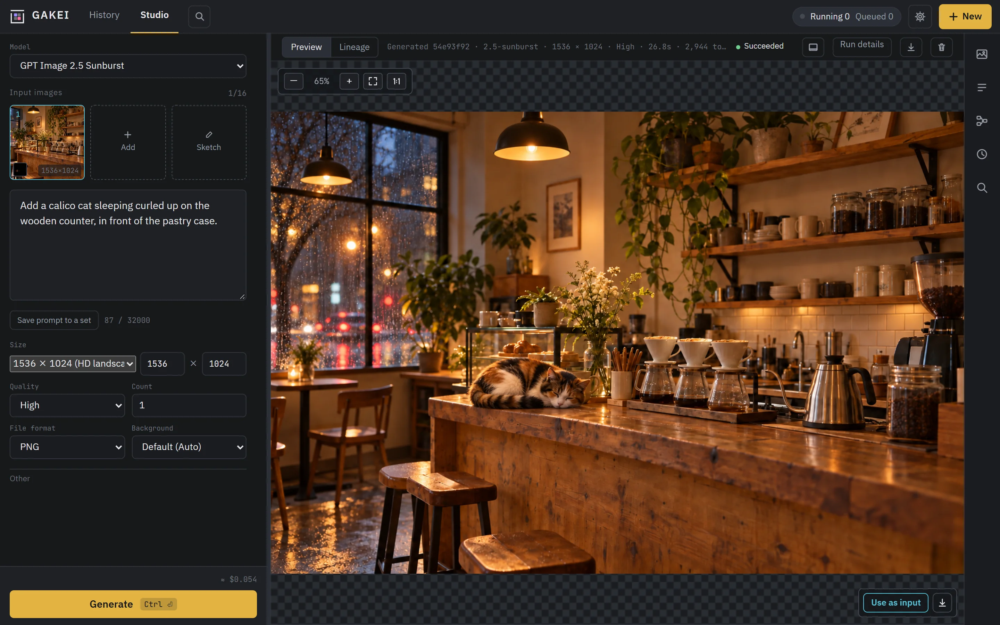
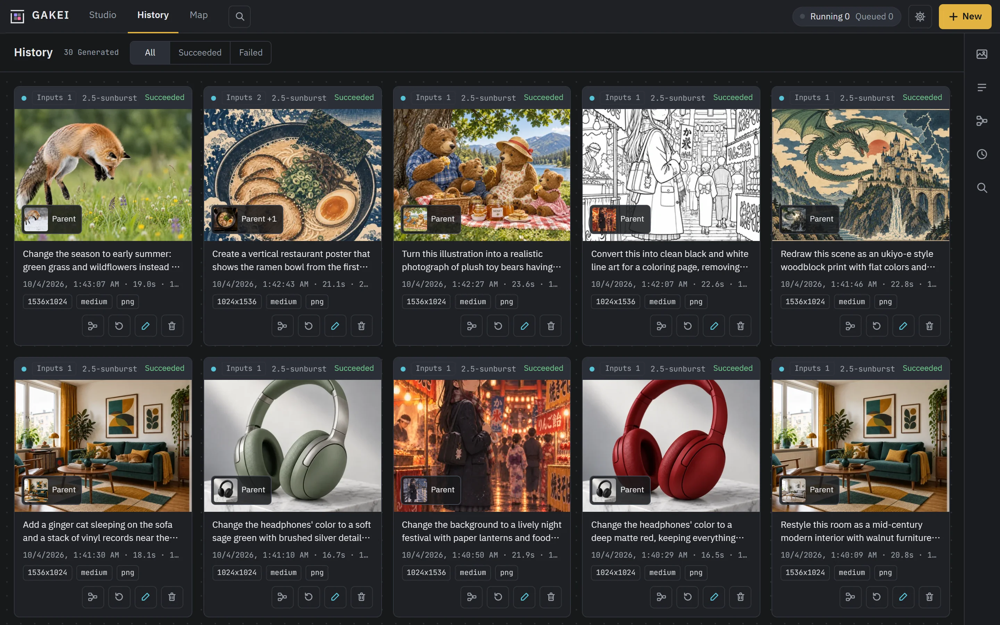
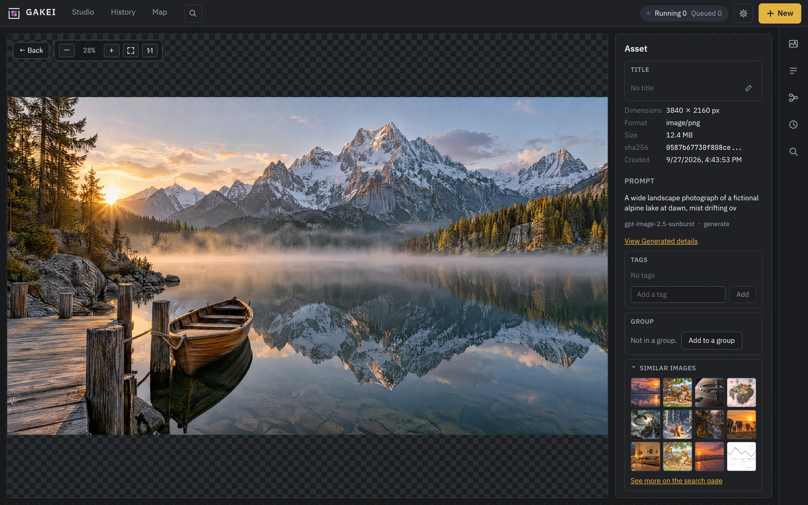
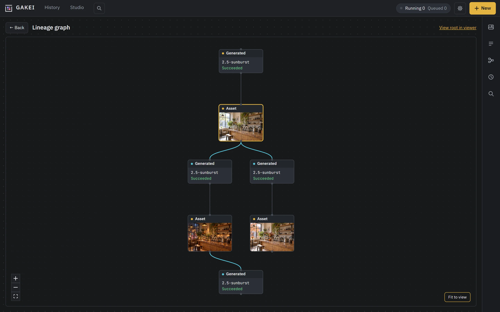
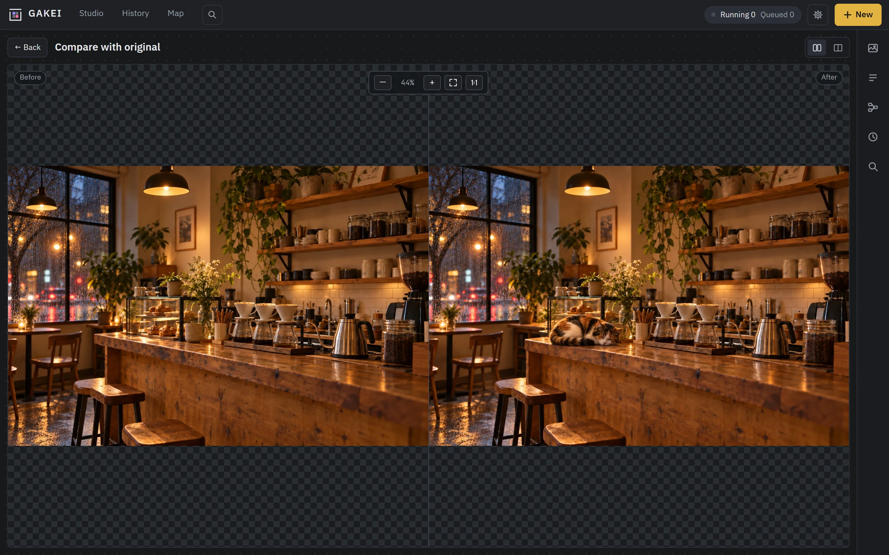
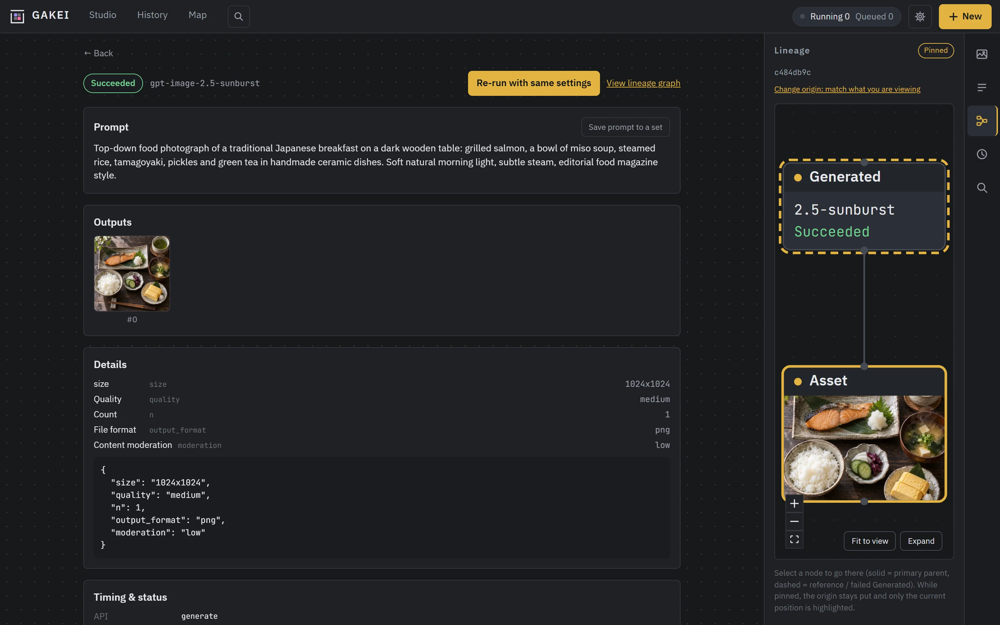
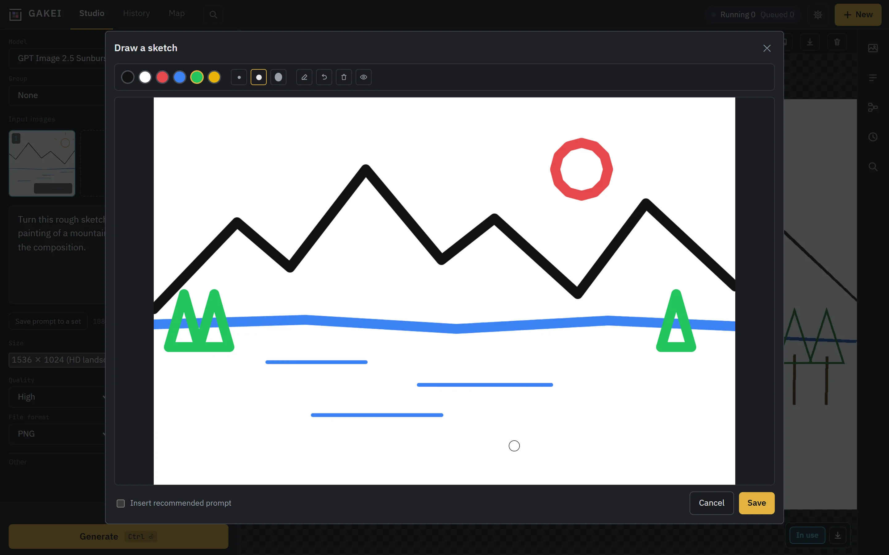
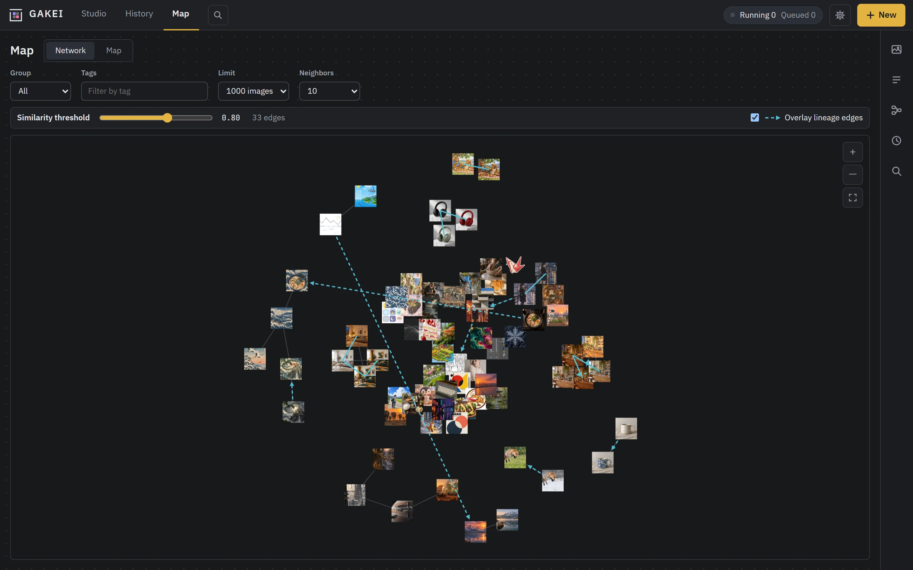
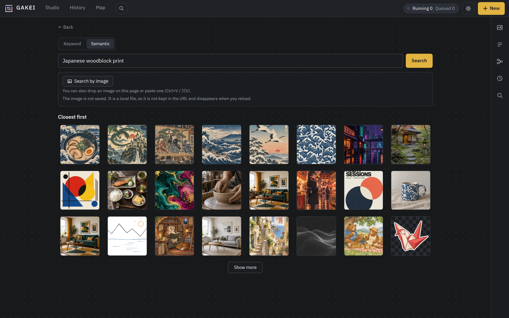

# GAKEI

English | [日本語](README.md)

A self-hosted web tool for the Generate / Edit endpoints of the gpt-image family of APIs. It brings together generation and editing forms, a 4K image viewer, mask and sketch drawing, run history, and image lineage (which image was made from which) in one place. It is intended for personal use on your own machine.

All it needs is an OpenAI API key. Images are stored in a local directory and metadata in SQLite.



## Features

- **Generate / Edit:** run with a chosen model, size (presets or any width × height), quality, output format, background, number of images, and so on. An estimated cost is shown before running.
- **Edit inputs:** use past results, local images, or images pasted from the clipboard as input (up to 16, reorderable). Draw masks with a brush. Sketches drawn on a blank canvas or on top of an input image can also be used as input.
- **History:** every run is recorded, including failures and cancellations. Re-running with the same settings is kept as a new run.
- **Viewer:** zoom images up to 3840px, download the original, and compare an Edit's inputs and outputs.
- **Stock / prompt sets / lineage graph:** open saved images, named prompts, and image parent-child relationships from the sidebar. Type `@` in the prompt field to insert a prompt set.
- **Text search, similar images, duplicate candidates, map:** turn images into vectors with a CLIP-family model to find images by natural-language text, list similar or near-duplicate images, and show a map where similar images cluster together. Disabled by default; enable it in admin settings → Embeddings. The model runs locally on the CPU or on your own inference server. See [docs/embeddings.md](docs/embeddings.md) (Japanese).
- **Embedded lineage:** PNGs downloaded at full resolution carry their lineage. Uploading such a PNG back to the same GAKEI treats it as the original image.
- **Display language:** Japanese and English. Follows the browser's language by default and can be switched from Settings.
- **Layout:** The input pane of the studio can sit at the bottom (default) or in a left sidebar. Switch from Settings → Display or the button in the result area.
- **Local ComfyUI (preview):** connect to ComfyUI running on the same machine and use workflows exported with "Export (API)" alongside the OpenAI models. GAKEI only injects values such as prompt, seed, input images, and masks; it does not modify the graph. Disabled by default; connect from Settings → ComfyUI, then register workflows with "+ Register workflow" in the "Workflows" section of the same page (`/settings/comfyui`; the register/edit screen also opens inside Settings and is saved with "Save" at the top). If a node input seems to contain an API key or similar secret, registration shows a warning (share links hide the value and do not serve the originals of those images).

## Screenshots

| History | Viewer (4K) |
|---|---|
|  |  |
| **Lineage graph** | **Compare before and after an edit** |
|  |  |
| **Run details with the lineage sidebar** | **Drawing a sketch to use as input** |
|  |  |
| **Map (network of similar images with lineage)** | **Semantic search ("Japanese woodblock print")** |
|  |  |

Except for the hand-drawn sketches, all images in the screenshots are samples generated with GPT Image 2.5.

## Requirements

- [Git](https://git-scm.com/)
- [Node.js](https://nodejs.org/) 22.12 or later (24 LTS recommended), used to build the UI
- An OpenAI API key with access to the image APIs

Python and [uv](https://docs.astral.sh/uv/) are set up by the launcher script (if uv is missing, it asks before installing it). Tested on Windows and Linux.

## Quick start

```bash
git clone https://github.com/zolgear/gakei.git
cd gakei
./run.sh          # On Windows use run.bat (double-clicking it from Explorer also works)
```

The first run takes a few minutes to fetch dependencies and build the UI. Once started, a browser opens at `http://127.0.0.1:8000`. Register your OpenAI API key from the gear icon (Settings) in the top right to start generating and editing.

- **Updating:** run `git pull`, then `./run.sh` (`run.bat`) again. The UI is rebuilt automatically if its source has changed.
- **Startup options:** `--port 8001`, `--data-dir <absolute path>`, `--no-browser` (don't open a browser), `--host`.
- **Data:** generated images, SQLite, and the API key saved from Settings (`secrets.json`) live under `data/`. Back up or delete that directory as a whole. Don't delete or move image files inside it directly — the images will stop displaying. Delete images from the UI instead ([docs/configuration.md](docs/configuration.md), Japanese).
- **Share links:** show one image, or its lineage (with ancestors, or ancestors and descendants), through a link that needs no sign-in. Viewers see the images and the prompts and parameters used to make them. Enable it in the admin settings under "Public share links" and press "Save" at the top of the page first. In personal mode, expose only the share page's paths through a reverse proxy. See [docs/sharing.md](docs/sharing.md) (Japanese).
- **Lineage export and import:** export an image's lineage (this image and its ancestors, or the whole lineage) as a ZIP with the original images and the Generated records (prompts and parameters). The recipient imports it with "Import lineage" in the stock panel into their own GAKEI (another user on the same instance, or another instance) and can keep editing. Imported records carry an "Imported" mark and are treated as unverified. See [docs/lineage-export.md](docs/lineage-export.md) (Japanese).
- **Using it from AI agents:** register GAKEI as an MCP server in an AI agent such as Claude Code to generate images and search your stock from the agent. Enable it in Settings → MCP and press "Save" at the top of the page first. See [docs/mcp.md](docs/mcp.md) (Japanese).
- **Using a proxy such as LiteLLM:** change the connection through Settings → OpenAI (Base URL), or the `OPENAI_BASE_URL` environment variable. The proxy must offer the same model names GAKEI sends (GAKEI does not remap model names). Prices shown in the UI are still OpenAI's list prices and may not match the actual bill through a proxy.

Configuration through environment variables (API key, base URL, data directory, timeouts, and so on) is described in [docs/configuration.md](docs/configuration.md) (Japanese). It is not usually needed.

## Docker

If you want to run GAKEI on a machine that's always on — a home server, a NAS, an internal Linux box — Docker is also an option (for a personal PC, the quick start above is still recommended). With Docker you don't even need to clone the repo, or install Node or uv.

### Run the published image (no clone needed)

```bash
docker run -d --name gakei --restart unless-stopped \
  -p 127.0.0.1:8000:8000 \
  -v gakei-data:/data \
  -e OPENAI_API_KEY=sk-... \
  ghcr.io/zolgear/gakei:latest
```

You can leave out `-e OPENAI_API_KEY=...` and register the key from Settings after it starts instead. If you keep your settings in a `.env` file, pass `--env-file .env`.

For Compose, write your own minimal `compose.yaml` like this (the one in the repository is for people who clone and build; it's a different file):

```yaml
services:
  gakei:
    image: ghcr.io/zolgear/gakei:latest
    restart: unless-stopped
    ports:
      - "127.0.0.1:8000:8000"
    volumes:
      - gakei-data:/data
volumes:
  gakei-data:
```

- **Updating:** `docker pull ghcr.io/zolgear/gakei:latest`, then recreate the container (`docker rm -f gakei`, then run the `docker run` command again). With Compose, `docker compose pull && docker compose up -d`. **Back up `data/` before updating** — startup runs a database migration automatically, and you'll need a backup to roll back (see the backup example below).
- **Rolling back:** when you go back to an older image tag, also restore `data/` (and the database, if you use PostgreSQL) from the backup taken before updating. If you start an older version on a database already used by a newer one, it stops with "has been used by a newer version of GAKEI" and leaves the database unchanged (a database can't be migrated back to an older version).
- **Tags:** `latest` (the newest stable release), plus `0.y` and `0.y.z`. See the full list under [Releases](https://github.com/zolgear/gakei/releases) on GitHub.

### Build it yourself (if you want to make changes)

```bash
git clone https://github.com/zolgear/gakei.git
cd gakei
echo "POSTGRES_PASSWORD=your-password" >> .env
docker compose up -d --build
```

Once it's running, open `http://127.0.0.1:8000`. A `.env` at the repository root is read if present (`HOST`/`PORT`/`DATA_DIR` are overridden with the container's values).

- **PostgreSQL is bundled (ADR-0027).** Without `POSTGRES_PASSWORD` in `.env`, it won't start. To keep using SQLite instead, comment out the PostgreSQL-related settings following the comments inside `compose.yaml`. Usage and migration: [docs/postgresql.md](docs/postgresql.md) (Japanese).
- **Updating:** `git pull && docker compose up -d --build`

### Common notes

- **Data:** stored in a named volume. The volume is called `gakei-data` in the `docker run` example above, or `gakei_gakei-data` with the repository's `compose.yaml` (prefixed with the Compose project name, which defaults to the directory name). Backup example (adjust the volume name):
  ```bash
  docker run --rm -v gakei-data:/data -v "$PWD":/backup busybox tar czf /backup/gakei-data.tgz -C /data .
  ```
- **Exposure:** defaults to `127.0.0.1` only. With `docker run`, change the `-p` mapping; with the repository's `compose.yaml`, use `GAKEI_BIND=0.0.0.0` (and `GAKEI_PORT`) to expose it to the LAN or the internet. Either way, there is no authentication by default, so if you expose it, enable login with `AUTH_MODE=oidc` ([docs/auth.md](docs/auth.md)) or put an authenticating reverse proxy in front.
- **ComfyUI:** connect to ComfyUI running on the same host at `http://host.docker.internal:8188` (Settings → ComfyUI). With plain `docker run`, add `--add-host=host.docker.internal:host-gateway` for this to resolve (the repository's `compose.yaml` already sets this up).
- **Run only one replica.** Jobs run inside the api process, so whether the DB is SQLite or PostgreSQL, don't share the same DB / volume across multiple containers.

The version you're running is shown in Settings under "About GAKEI". See [Releases](https://github.com/zolgear/gakei/releases) on GitHub for the full list (release process: [docs/release.md](docs/release.md), Japanese).

## Notes

- **There is no authentication by default.** GAKEI listens only on `127.0.0.1`, so it can be opened only from the same machine. For multiple users, set `AUTH_MODE=oidc` and the OIDC settings (e.g. Google or Keycloak) in `.env`; login is then required, and only the people listed in `AUTH_ADMIN_EMAILS` can change admin settings such as the API key. See [docs/auth.md](docs/auth.md).
- **To use it from another machine, use an SSH port forward.** For example: `ssh -L 8000:127.0.0.1:8000 <server>`. If you expose it on the LAN with `--host 0.0.0.0`, anyone on the same network can generate images with your key or replace the key.
- **The API key is stored in plain text in `data/secrets.json`.** Don't share `data/` with others.
- **ComfyUI Desktop also uses port 8000 by default.** When running both, start GAKEI with something like `--port 8792`.

## Development

GAKEI is built with AI agents in [Claude Code](https://claude.com/claude-code), and we recommend Claude Code for making changes as well. [CLAUDE.md](CLAUDE.md) at the repository root describes the commands, structure, and working rules; agents read it before starting work. If you make changes by hand, read it first too.

The project is developed in Japanese: code comments, CLAUDE.md, and the design documents under `docs/` are written in Japanese. English covers only the UI, the messages the server returns, the launcher's output, and this README.

### Running locally

```bash
cd frontend && npm ci && npm run build        # build the UI (the backend serves dist/)
cd ../backend && FAKE_PROVIDER=1 DATA_DIR=$(mktemp -d) uv run python -m app   # no billing, throwaway data
```

To work on the UI with live reload, keep the backend running and run `npm run dev` in `frontend/` (`/api` is proxied to `127.0.0.1:8000`). Without `FAKE_PROVIDER` and `DATA_DIR`, the server uses your real API key and `data/`.

### Tests and lint

```bash
cd backend && uv run pytest -q && uv run ruff check . && uv run ruff format --check .
cd frontend && npm test && npm run lint && npm run build
```

After changing the API, run `npm run gen:api` in `frontend/` to regenerate the TypeScript types.

### Localization

UI strings are not written in code; they live in one JSON file per language (`frontend/src/i18n/locales/` for the UI, `backend/app/locales/` for the server). See [docs/localization.md](docs/localization.md) (Japanese) for how to add strings, fix translations, and add a language.

## License

[Apache License 2.0](LICENSE). See [NOTICE](NOTICE) for copyright notices.
