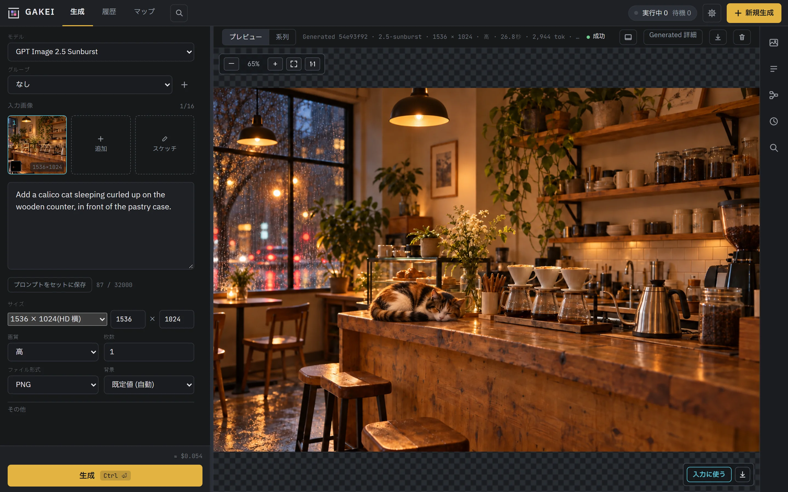
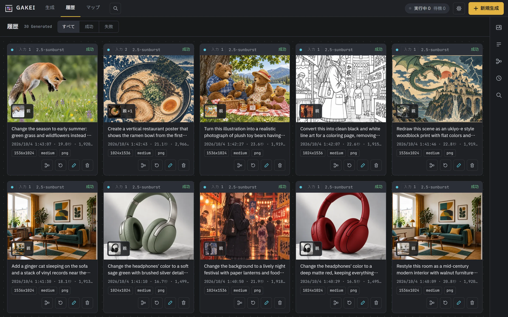
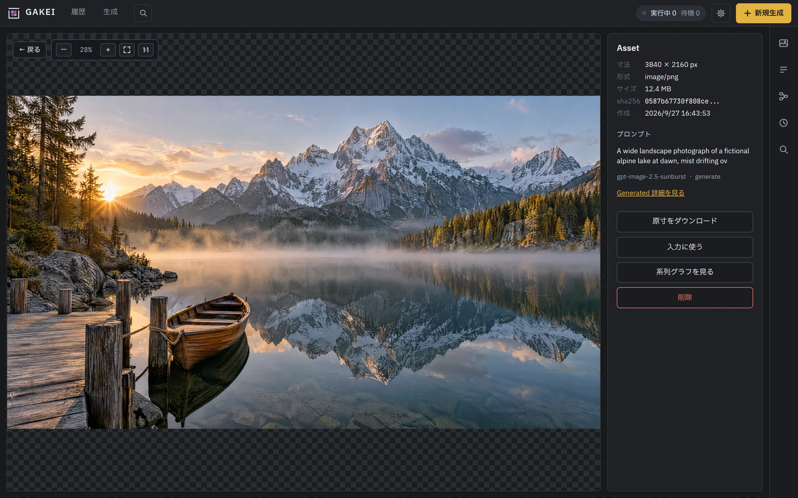
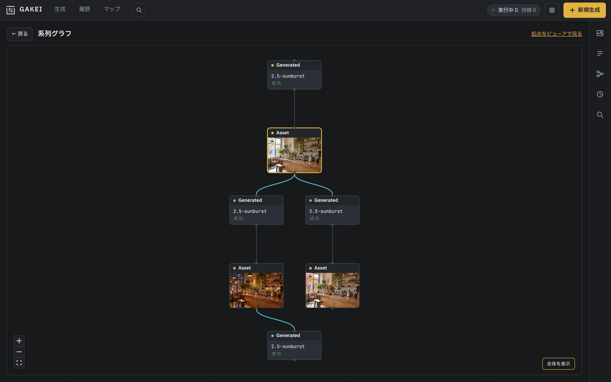
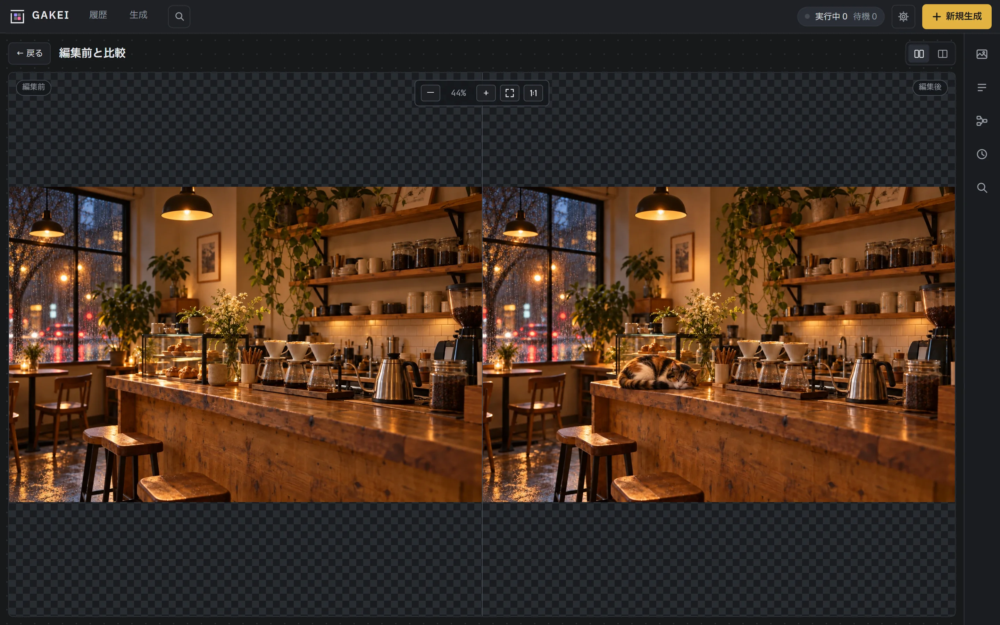
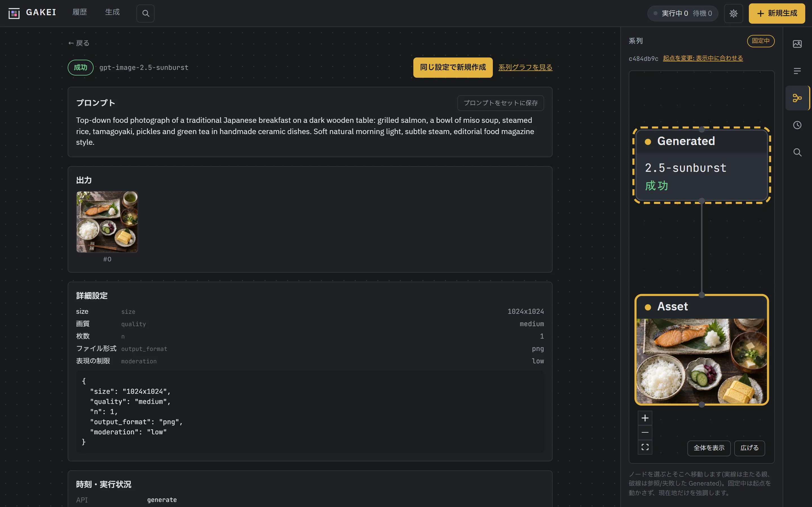
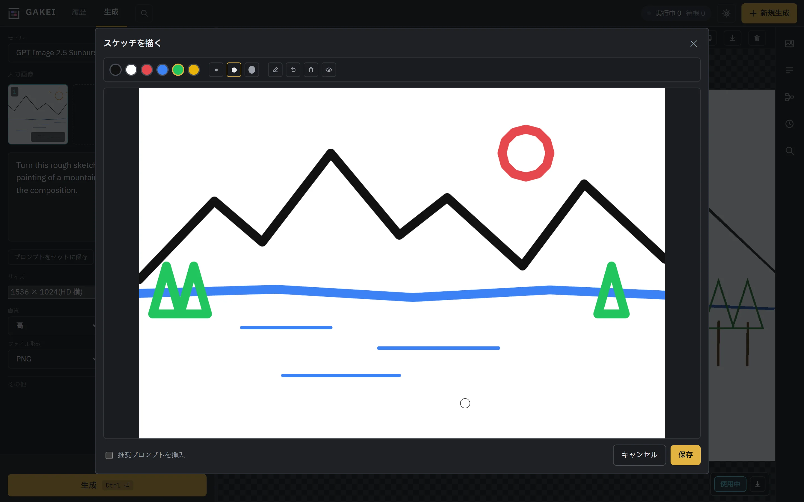
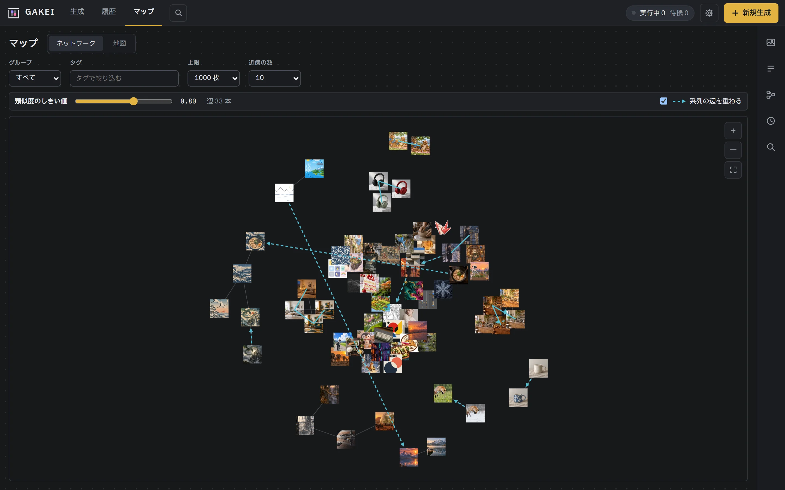
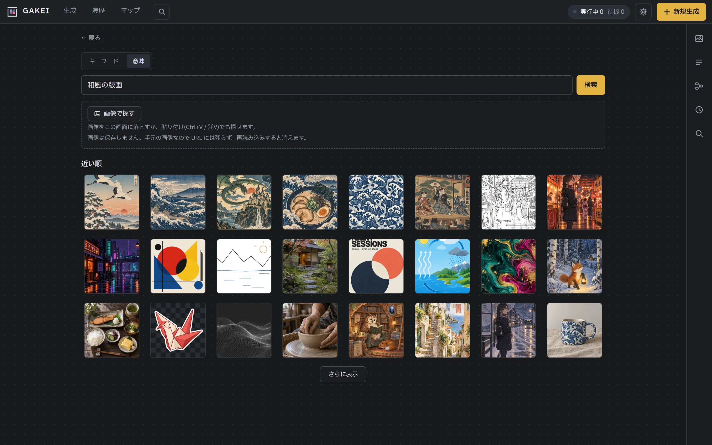

# GAKEI

[English](README.en.md) | 日本語

gpt-image 系 API の Generate / Edit を使うための、セルフホストの Web ツール。生成と編集のフォーム、4K 画像のビューア、マスクとスケッチの描画、実行履歴、画像の系列(どの画像から何を作ったか)の記録を一体で提供する。個人が自分の PC で使うことを想定している。

OpenAI API のキーがあれば動く。画像はローカルのディレクトリに、メタデータは SQLite に保存する。



## 機能

- **生成 / 編集:** モデル、サイズ(プリセットまたは任意の幅×高さ)、quality、出力形式、背景、枚数などを指定して実行する。実行前に参考料金を表示する。
- **Edit の入力:** 過去の結果、ローカルの画像、クリップボードからの貼り付けを入力にできる(最大16枚、並べ替え可)。ブラシでマスクを描ける。白紙や入力画像の上に描いたスケッチも入力にできる。
- **履歴:** 失敗や中止を含め、すべての実行を記録する。同じ設定での再実行は新しい実行として残る。
- **ビューア:** 最大 3840px の画像を拡大表示する。原寸のダウンロード、Edit の入力と出力の比較ができる。
- **ストック / プロンプトセット / 系列グラフ:** 保存した画像、名前を付けたプロンプト、画像の親子関係をサイドバーから開く。プロンプトセットはプロンプト欄で `@` を入力して呼び出す。
- **文章での検索・似た画像・重複の候補・マップ:** 画像を CLIP 系のモデルでベクトルにして、自然文で画像を探したり、似た画像やほぼ同じ画像を並べたり、似た画像が集まる地図を表示したりする。既定では無効で、管理者設定の「埋め込み」で有効にする。モデルはローカルの CPU で動かすか、手元の推論サーバーを使う。手順は [docs/embeddings.md](docs/embeddings.md)。
- **系列情報の埋め込み:** 原寸でダウンロードした PNG に系列情報を埋め込む。同じ GAKEI にその PNG をアップロードし直すと、元の画像として扱う。
- **表示言語:** 日本語と英語。既定はブラウザの言語に従い、設定画面で切り替えられる。
- **画面の配置:** 生成画面の入力欄は下段(既定)か左のサイドバーに置ける。設定画面(設定 → 表示)か結果エリアのボタンで切り替える。
- **ローカルの ComfyUI(プレビュー):** 同じ PC で動く ComfyUI に接続し、「Export (API)」で書き出したワークフローを OpenAI のモデルと並べて使う。GAKEI はプロンプト、seed、入力画像、マスクなどの値を差し込むだけで、グラフは変更しない。既定では無効で、設定画面(設定 → ComfyUI)から接続し、同じページの「ワークフロー」の節(`/settings/comfyui`)の「+ ワークフローを登録」から登録する(登録・編集の画面も設定の中で開き、上部の「保存」で保存する)。Prompt Enhancer などで実行時に書き直された最終プロンプトは、ワークフローの登録時にそのノード(`PreviewAny` など)を選んでおくと Run に記録され、ビューアに「最終プロンプト」として表示される(ADR-0030)。ノードの入力に API キーなどが直接書かれていそうなときは、登録時に警告する(共有リンクでは値を伏せ、その画像の原本は出さない)。

## 画面

| 履歴 | ビューア(4K) |
|---|---|
|  |  |
| **系列グラフ** | **編集前と比較** |
|  |  |
| **Generated の詳細と系列** | **スケッチを描いて入力にする** |
|  |  |
| **マップ(似た画像のネットワークと系列)** | **意味で検索(「和風の版画」)** |
|  |  |

スクリーンショット内の画像は、手描きのスケッチを除き GPT Image 2.5 で生成したサンプル。

## 必要なもの

- [Git](https://git-scm.com/)
- [Node.js](https://nodejs.org/) 22.12 以上(24 LTS 推奨)。画面のビルドに使う
- OpenAI の API キー(画像 API を使えるもの)

Python と [uv](https://docs.astral.sh/uv/) は起動スクリプトが用意する(uv がなければ、インストールしてよいか確認してから入れる)。動作を確認している OS は Windows と Linux。

## クイックスタート

```bash
git clone https://github.com/zolgear/gakei.git
cd gakei
./run.sh          # Windows は run.bat(エクスプローラーからダブルクリックでもよい)
```

初回は依存関係の取得と画面のビルドに数分かかる。起動するとブラウザで `http://127.0.0.1:8000` が開く。右上の歯車(設定)から OpenAI の API キーを登録すれば、生成と編集ができる。

- **更新:** `git pull` してから、もう一度 `./run.sh`(`run.bat`)を実行する。画面のソースが変わっていれば自動でビルドし直す。
- **起動オプション:** `--port 8001`、`--data-dir <絶対パス>`、`--no-browser`(ブラウザを開かない)、`--host`。
- **データ:** 生成した画像、SQLite、画面で保存した API キー(`secrets.json`)は `data/` にできる。バックアップや削除はこのディレクトリごと行う。中の画像ファイルを直接消したり動かしたりしない(画像が表示できなくなる。削除は画面から。[docs/configuration.md](docs/configuration.md))。
- **共有リンク:** 画像1枚、または系列(祖先まで/祖先と子孫)を、ログイン不要のリンクで見せる。画像と、それを作ったプロンプト・パラメーターが見える。管理者設定の「共有リンクの公開」で有効にし、ページ上部の「保存」を押してから使う。個人モードで外に出すときは、逆プロキシで共有のページのパスだけを出す。手順は [docs/sharing.md](docs/sharing.md)。
- **AI エージェントから使う:** Claude Code などの AI エージェントに MCP サーバーとして登録すると、生成やストックの検索をエージェントから行える。設定画面(設定 → MCP)で有効にし、ページ上部の「保存」を押してから使う。手順は [docs/mcp.md](docs/mcp.md)。
- **LiteLLM などのプロキシ経由で使う:** 設定画面(設定 → OpenAI の「接続先(Base URL)」。または環境変数 `OPENAI_BASE_URL`)で接続先を変えられる。プロキシ側に GAKEI が送るのと同じモデル名を用意する必要がある(モデル名の読み替えは行わない)。画面に出る料金の目安は OpenAI の価格のままで、プロキシ経由の実際の請求とは一致しないことがある。

環境変数での設定(API キー、接続先、保存先、タイムアウトなど)は [docs/configuration.md](docs/configuration.md) にまとめてある。通常は設定しなくてよい。

## Docker

自宅サーバーや NAS、社内の Linux サーバーなど、常時起動しているマシンに置きたい場合は Docker も使える(個人の PC では上のクイックスタートを推奨)。Docker があれば Node や uv、clone も不要。

### 公開イメージで起動する(clone 不要)

```bash
docker run -d --name gakei --restart unless-stopped \
  -p 127.0.0.1:8000:8000 \
  -v gakei-data:/data \
  -e OPENAI_API_KEY=sk-... \
  ghcr.io/zolgear/gakei:latest
```

`-e OPENAI_API_KEY=...` は省いて、起動後に設定画面から登録してもよい。`.env` ファイルを使う場合は `--env-file .env` を渡す。

Compose を使う場合は、次のような最小の `compose.yaml` を自分で用意する(リポジトリの `compose.yaml` は clone してビルドする人向けで、これとは別物):

```yaml
services:
  gakei:
    image: ghcr.io/zolgear/gakei:latest
    restart: unless-stopped
    ports:
      - "127.0.0.1:8000:8000"
    volumes:
      - gakei-data:/data
volumes:
  gakei-data:
```

- **更新:** `docker pull ghcr.io/zolgear/gakei:latest` してコンテナを作り直す(`docker rm -f gakei` してから上の `docker run` をもう一度)。compose なら `docker compose pull && docker compose up -d`。**更新の前に `data/` のバックアップを取る**(起動時に DB のマイグレーションが自動で走り、戻すにはバックアップが要る。下のバックアップ例を参照)。
- **古い版に戻す:** イメージのタグを戻すときは、更新前に取ったバックアップから `data/`(PostgreSQL なら DB も)を戻す。新しい版で使った DB のまま古い版を起動すると、「より新しい版の GAKEI で使われています」と出して、DB を変えずに起動を中止する(DB は古い版に戻せないため)。
- **タグ:** `latest`(最新の安定版)のほか、`0.y`、`0.y.z` がある。一覧は GitHub の [Releases](https://github.com/zolgear/gakei/releases)。

### 自分でビルドする(変更を加えたい場合)

```bash
git clone https://github.com/zolgear/gakei.git
cd gakei
echo "POSTGRES_PASSWORD=好きなパスワード" >> .env
docker compose up -d --build
```

起動したら `http://127.0.0.1:8000` を開く。リポジトリ直下に `.env` があれば読み込む(`HOST`/`PORT`/`DATA_DIR` はコンテナ用の値で上書きする)。

- **PostgreSQL を同梱している(ADR-0027)。** `.env` に `POSTGRES_PASSWORD` を指定しないと起動しない。SQLite のまま使いたい場合は、`compose.yaml` の中のコメントに従って PostgreSQL 関連の設定をコメントアウトする。使い方と移行手順は [docs/postgresql.md](docs/postgresql.md)。
- **更新:** `git pull && docker compose up -d --build`

### 共通の注意事項

- **データ:** 名前付きボリュームに入る。ボリューム名は `docker run` の例では `gakei-data`、リポジトリの `compose.yaml` では `gakei_gakei-data`(先頭はコンポーズのプロジェクト名。既定ではディレクトリ名になる)。バックアップ例(ボリューム名を読み替える):
  ```bash
  docker run --rm -v gakei-data:/data -v "$PWD":/backup busybox tar czf /backup/gakei-data.tgz -C /data .
  ```
- **公開範囲:** 既定は `127.0.0.1` のみ。`docker run` の場合は `-p` の指定を変え、リポジトリの `compose.yaml` の場合は `GAKEI_BIND=0.0.0.0`(と `GAKEI_PORT`)で LAN やインターネットに公開できるが、既定では認証がないので、公開する場合は管理者設定の「認証」で OIDC の認証を有効にする([docs/auth.md](docs/auth.md))か、認証付きのリバースプロキシを前段に置く。
- **ComfyUI:** 同じホストで動く ComfyUI には `http://host.docker.internal:8188` で接続する(設定 → ComfyUI)。Docker で `host.docker.internal` を使うには `docker run` に `--add-host=host.docker.internal:host-gateway` を足す(リポジトリの `compose.yaml` は設定済み)。
- **画像を Azure Blob Storage / S3 互換ストレージに置ける(ADR-0028)。** `STORAGE_BACKEND` ほかの環境変数で切り替える。アバターや `secrets.json` のために、ボリューム(`DATA_DIR`)は引き続き要る。設定例と移行手順は [docs/object-storage.md](docs/object-storage.md)。
- **レプリカは1つだけ。** ジョブの実行が api プロセス内で行われるため、DB が SQLite・PostgreSQL のどちらでも、同じ DB / ボリュームを複数のコンテナで共有しない。

使っている版は設定画面の「GAKEI について」に出る。リリースの一覧は GitHub の [Releases](https://github.com/zolgear/gakei/releases)(手順は [docs/release.md](docs/release.md))。

## 注意事項

- **既定では認証がない。** 既定では `127.0.0.1` だけで待ち受け、同じ PC からしか開けない。複数人で使う場合は、管理者設定の「認証」で OIDC の接続(Google、Keycloak など)と管理者のメールを設定し、テストログインに成功してから認証を有効にすると、ログインが必要になる(再起動は要らない)。管理者のメールに載せた人だけが API キーなどの管理者設定を変えられる。`.env` で設定することもでき、誰もログインできなくなったときは `.env` に `AUTH_MODE=none` を書いて再起動すれば一時的に無効にできる。手順は [docs/auth.md](docs/auth.md)。
- **別の端末から使う場合は、SSH のポートフォワードを使う。** 例: `ssh -L 8000:127.0.0.1:8000 <サーバー>`。`--host 0.0.0.0` で LAN に公開すると、同じネットワークの誰でも、登録したキーで画像を生成したり、キーを差し替えたりできる。
- **API キーは `data/secrets.json` に平文で保存される。** `data/` を他人と共有しない。
- **ComfyUI Desktop の既定のポートは 8000 で、GAKEI と重なる。** 両方を使うときは、GAKEI を `--port 8792` などで起動する。

## 開発

GAKEI は [Claude Code](https://claude.com/claude-code) の AI エージェントで実装している。変更を加えるときも Claude Code の利用を勧める。リポジトリ直下の [CLAUDE.md](CLAUDE.md) に、コマンド、構成、作業上のルールをまとめてあり、エージェントはこれを読んでから作業する。手で変更する場合も、まず CLAUDE.md に目を通してほしい。

コード中のコメント、CLAUDE.md、`docs/` の設計資料は日本語で書いている。英語に対応しているのは、画面、サーバーが返すメッセージ、起動スクリプトの表示、README だけ。

### ローカルで動かす

```bash
cd frontend && npm ci && npm run build        # 画面をビルドする(dist/ をバックエンドが配信する)
cd ../backend && FAKE_PROVIDER=1 DATA_DIR=$(mktemp -d) uv run python -m app   # 課金なし・一時データで起動
```

画面を編集しながら確認するときは、バックエンドを起動したまま `frontend/` で `npm run dev` を実行する(`/api` は `127.0.0.1:8000` にプロキシされる)。`FAKE_PROVIDER` と `DATA_DIR` を省くと、実際の API キーと `data/` を使う。

### テストと lint

```bash
cd backend && uv run pytest -q && uv run ruff check . && uv run ruff format --check .
cd frontend && npm test && npm run lint && npm run build
```

API を変えたら、`frontend/` で `npm run gen:api` を実行して TypeScript の型を再生成する。

### ローカライズ

画面の文言はコードに直接書かず、言語ごとの JSON に置いている(フロントは `frontend/src/i18n/locales/`、サーバーは `backend/app/locales/`)。文言の追加、翻訳の修正、言語の追加の手順は [docs/localization.md](docs/localization.md) を参照。

## ライセンス

[Apache License 2.0](LICENSE)。著作権表示は [NOTICE](NOTICE) を参照。
