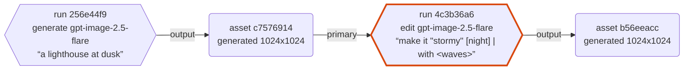

# AI エージェントから使う(MCP)

GAKEI は MCP(Model Context Protocol)のサーバーとして動き、Claude Code などの AI エージェントから画像の生成、ストックの検索、グループへの整理ができる。設計は [ADR-0023](adr/0023-mcp-server.md)。

エンドポイントは GAKEI と同じサーバーの `/mcp`(Streamable HTTP)。別のプログラムをインストールする必要はない。

## 1. 有効にする

既定では無効になっている。管理者が設定画面の「管理者設定」→「MCP」(`/settings/mcp`)で有効にし、ページ上部の「保存」を押す。

- **1 時間あたりの上限:** MCP 経由で作れる Run の数。既定は 30 件で、0 にすると生成を止め、検索などの参照だけ使える。エージェントは人より速く繰り返し呼ぶので、課金の暴走を防ぐために使う。
- 接続先の URL と登録コマンドの例も、この画面に出る。

## 2. エージェントに登録する

### 個人モード(既定。認証なし)

Claude Code の場合:

```bash
claude mcp add --transport http gakei http://127.0.0.1:8000/mcp
```

ポートを変えている場合は URL を合わせる。

### 認証モード(`AUTH_MODE=oidc`)

エージェントはブラウザのログインを使えないので、アクセストークンで接続する。

1. 画面の「ユーザー設定」→「アクセストークン」(`/settings/access-tokens`)で、名前・有効期限・権限を選んでトークンを発行する。値は発行したときに 1 回だけ表示されるので、その場でコピーする。
2. トークンをヘッダーに付けて登録する。

```bash
claude mcp add --transport http gakei https://gakei.example.com/mcp \
  --header "Authorization: Bearer gakei_..."
```

- トークンは発行した人として動き、そのトークンで作った Run の実行者もその人になる。
- 漏れた、または使わなくなったトークンは、同じ画面で失効させる。
- トークンが使えるのは `/mcp` と、画像の本体を取る `GET /api/assets/{id}/content` だけ。他の REST API には使えない(「4. 画像の受け渡し」)。

#### 有効期限と権限

発行のときに、有効期限と権限を選ぶ([ADR-0023](adr/0023-mcp-server.md) 11 章)。

- **有効期限:** 30 日 / 90 日(既定)/ 1 年 / 無期限。期限を過ぎたトークンは、`/mcp` でも画像の本体の GET でも 401 になり、期限切れである旨の文言を返す。期限は後から延ばせないので、延ばしたいときは新しいトークンを発行して入れ替える。期限切れのトークンも、失効させるまでは一覧に「期限切れ」と出る。この機能より前に発行したトークンは無期限のまま。
- **権限:** すべて(既定)/ 読み取りのみ。この機能より前に発行したトークンは「すべて」。
  - 読み取りのみのトークンで使えるツールは、`get_capabilities`、`estimate_cost`、`get_run`、`list_runs`、`search_assets`、`find_similar_assets`、`get_asset`、`get_image`、`list_prompt_sets`、`list_groups`、`create_download_url`。どれも GAKEI のデータを変えない。
  - `generate_image`、`cancel_run`、`upload_image`、`create_upload_url`、`create_group`、`move_to_group` は使えない。`tools/list` に出ず、呼んでもツールのエラーになる。生成(課金)させたくないエージェントには、読み取りのみのトークンを渡す。
  - 画像の本体の GET は、読み取りのみのトークンでも使える。
- トークンで発行したアップロード URL・ダウンロード URL は、使う時点でもトークンが有効か(失効も期限切れもしていないか)を確かめる。

### その他のエージェント

Streamable HTTP に対応したクライアントなら、URL(と認証モードではヘッダー)を登録すれば使える。stdio のサーバーしか登録できないクライアント(Claude Desktop の設定ファイルなど)では、`mcp-remote` のような中継を使う。

```json
{
  "mcpServers": {
    "gakei": {
      "command": "npx",
      "args": ["-y", "mcp-remote", "http://127.0.0.1:8000/mcp"]
    }
  }
}
```

## 3. 使えるツール

| ツール | 内容 |
|---|---|
| `get_capabilities` | 使えるプロバイダー、モデル、パラメーター、サイズ。画像の埋め込み(文章での検索、似た画像)が使えるか(`embeddings`) |
| `estimate_cost` | 生成する前に料金の目安(USD)を出す。Run は作らない |
| `generate_image` | Generate / Edit を実行する(**課金を伴う**)。入力画像とマスクは Asset ID で渡す。Run を登録したらすぐ `run_id` を返す |
| `get_run` | Run の状態、出力、料金の目安、1 時間の上限の残り、系列グラフ(`lineage_mermaid`)。完了まで待つこともできる(1 回最大 25 秒) |
| `list_runs` | 自分の最近の Run の一覧(実行元、作成時刻、状態で絞り込み) |
| `cancel_run` | 待機中の Run を取り消す |
| `search_assets` | ストックを検索する(キーワード、種類、グループ、タグ)。`mode="semantic"` で文章での検索(意味の近い順) |
| `find_similar_assets` | 1 枚の画像に似た画像を、似ている順に返す |
| `get_asset` | Asset の情報、主たる親、生成した Run、系列グラフ(`lineage_mermaid`) |
| `get_image` | 画像を見る。長辺 1568px(既定)か 512px の JPEG / PNG を応答の本文に載せて返す |
| `create_download_url` | 原本を取り出すための、10 分間・1 回限りのダウンロード URL を発行する |
| `create_upload_url` | ローカルの画像ファイルを送るための、10 分間・1 回限りのアップロード URL を発行する |
| `upload_image` | 画像(base64)を取り込む。小さい画像向け。大きい画像は `create_upload_url` を使う |
| `list_prompt_sets` | プロンプトセットの一覧 |
| `list_groups` / `create_group` / `move_to_group` | グループの一覧、作成、Asset の移動 |

削除と設定の変更は提供していない。画面で行う。

**閲覧範囲:** 認証モードでは、どのツールもトークンの持ち主が作ったものだけを扱う(画面と同じ。ADR-0025)。他人の Run・画像・グループ・プロンプトセットは検索にも一覧にも出ず、id を指定しても「見つからない」エラーになる。入力画像や出力先のグループにも自分のものだけを指定できる。画像の本体(`GET /api/assets/{id}/content`)をトークンで取るときも同じ。管理者のトークンでも他人のものは見えない(個人モードの頃のデータだけは管理者に見える)。

- 出力は Asset ID、原本の URL、画面で開く URL で返る。本文に載る画像はサムネイル(512px の JPEG / PNG)だけ。エージェントが画像を細かく見るには `get_image`、加工のために原本が要るときは `create_download_url` を使う(「4. 画像の受け渡し」)。結果の URL は利用者がブラウザで開くためのもの。
- `get_asset` は、原本から数えた透過の情報を返す。`has_alpha`(アルファチャンネルがあるか)と `transparent_ratio`(alpha < 255 のピクセルの割合。0〜1)。サムネイルでは透過かどうか分かりにくいので、背景を透過にしたかの確認に使う。
- MCP 経由で作った Run は、Run の詳細に「実行元: MCP」と出る。

### 文章での検索と似た画像

管理者設定の「埋め込み」を有効にしていると(ADR-0033)、次の2つが使える。使えるかは `get_capabilities` の `embeddings.available` で分かる。無効のときはエラーを返す。

- `search_assets(query="夕暮れの海辺", mode="semantic")`: 画像の埋め込みで、文章の意味に近い順に返す。プロンプトやタグの無い画像も見つかる。各結果の `score` はコサイン類似度。`kind`・`group_id`・`tag`・`limit` で絞り込める。`mode` を省くと、これまでどおりのキーワード検索(新しい順)。
- `find_similar_assets(asset_id=..., limit=12)`: その画像に似た画像を返す(その画像自身は含めない)。その画像の埋め込みをまだ計算していなければエラーになる。

`embeddings.multilingual` が `false` のモデル(既定の OpenAI CLIP など)は英語だけを理解するので、文章は英語で書く。見える範囲は他のツールと同じで、他人の画像は結果に出ない。

### 生成の流れ

`generate_image` は完了を待たず、Run を登録したらすぐ `run_id` と状態(`queued` など)を返す。完了は `get_run` の `wait_seconds` で待つ。1 回の待ちは最大 25 秒で、終わっていなければ現在の状態が返るので、`succeeded`・`failed`・`canceled` になるまで繰り返す。MCP クライアントのタイムアウトで応答を受け取れず、`run_id` が分からなくなるのを避けるため。

```text
generate_image(prompt="a lighthouse at dusk", params={"size": "1024x1024", "quality": "low"})
  → {"run_id": "…", "status": "queued", "quota": {"remaining": 29, …}, "cost": {…}}
get_run(run_id="…", wait_seconds=25)
  → {"status": "succeeded", "outputs": [{"asset_id": "…", "url": "…"}], …}
```

- `run_id` を見失ったときは `list_runs` で探せる。例: `list_runs(origin="mcp", since="2026-09-28T10:00:00Z")`。自分(トークンの持ち主)が作った Run だけを返す。個人モードでは全部の Run が自分の Run になる。
- `wait=true` を付けると `generate_image` 自身も最大 25 秒待つ。打ち切っても `run_id` は返る。
- **サイズは `params.size` に入れる**(`"1024x1024"` のような `幅x高さ`、または `"auto"`)。指定できる範囲は `get_capabilities` の `providers[].size` にある。画質などの他のパラメーターも `params` に入れる。`get_capabilities` の結果の `example_generate_image` がそのまま使える呼び出しの例になっている。

### 料金の目安と上限の残り

- `estimate_cost(provider, model, params, n)` は、画面の見積もりと同じ計算で料金の目安(USD)を返す。`params.quality` と `params.size` を指定しないと(`auto` のままでは)見積もれず、`total_usd` が `null` になって `unavailable_reason` に理由が入る。入力画像(`input_asset_ids`)とプロンプトも渡すと、その分のトークンも数える。ComfyUI のように料金表の無いプロバイダーは見積もれない。
- Run の結果(`generate_image`・`get_run`・`list_runs`)の `cost` には、分かる場合だけ料金の目安が入る。完了した Run は実際の使用量(usage)から、実行前・実行中の Run はパラメーターからの見積もり(`basis` で区別)。どちらも請求額ではない。
- 同じく `quota` に 1 時間の上限(`hourly_run_limit`)、直近 1 時間の件数(`runs_last_hour`)、残り(`remaining`)が入る。

### 系列グラフ(`lineage_mermaid`)

`generate_image`・`get_run`・`get_asset` の結果には、画像がどう作られたかを表す Mermaid の `flowchart` の文字列 `lineage_mermaid` が付く(ADR-0023 9章)。エージェントが Asset と Run の関係(どの画像を元に、どの Run で作ったか)を読み取るためのもの。Mermaid を表示できる画面に貼れば、そのまま図になる。

- `get_run`(`generate_image` を含む): 入力画像とその祖先 → この Run → 出力。出力から数えて祖先 3 世代まで。入力の無い generate は Run → 出力だけ。実行前・実行中でも入力と Run は描く。
- `get_asset`: その画像を起点に、祖先 3 世代と子孫 2 世代。
- 角丸の箱が Asset(画像)、六角形が Run(API の 1 回の実行)。矢印は「入力 Asset → Run → 出力 Asset」の向きで、入力の辺には役割(`primary` = 主たる親、`reference` = 他の入力画像、`mask`)を書く。起点は太枠。
- ラベルの ID は先頭 8 文字だけ。完全な ID は先頭のコメント行(`%% a1 = asset <ID>`)にあり、そのまま `input_asset_ids` などに渡せる。
- 削除済みは「(deleted)」、他の GAKEI や他の環境で作られた画像に埋め込まれていた系列(自己申告で未検証)は「(embedded, unverified)」と付く。
- 世代の上限より先がある場合は「… older ancestors」「… more descendants」の注記ノードが付く。ノード数の上限(40)に掛かった場合は `%% truncated:` のコメントと注記ノードが付く。
- 画面の系列グラフと同じ探索で作るので、見える範囲も同じ(認証モードでは自分のものだけ)。
- プロンプトなどの文字列は Mermaid のエンティティ(`#quot;` など)に置き換えてあり、構文を壊さない。
- 不要なら `include_lineage=false` で付けない。`list_runs` には付かない。



(generate → その出力を `input_asset_ids` に渡した edit の後の `get_run`。FAKE プロバイダーでの出力例)

## 4. 画像の受け渡し

### 生成結果を続けて編集する(asset_id を渡す)

GAKEI にある画像(前の生成結果、ストックの画像)を続けて編集するときは、その `asset_id` を `generate_image` の `input_asset_ids` にそのまま渡す。`get_run` の `outputs[].asset_id`、`search_assets` や `get_asset` の結果の ID が使える。原本をダウンロードしてアップロードし直す必要はない。

- 転送が要らず、原本の画質のまま編集できる。
- 系列(どの画像を元に作ったか)が GAKEI に残る。アップロードし直すと、別の画像として取り込まれて系列がつながらない。
- アップロードは、GAKEI にまだ無い画像(ローカルのファイル、GAKEI の外で作った・加工した画像)だけに使う。

MCP の説明とツールの説明にもこの使い方を書いてあるので、エージェントは通常こちらを選ぶ。

### ローカルの画像を送る(アップロード URL)

`upload_image` は画像を base64 でツールの引数に書くので、数 MB の画像ではエージェントのトークンを大量に使う。ローカルのファイルは、`create_upload_url` で URL を発行し、curl などで本文をそのまま送る。

```bash
# create_upload_url の結果の upload_url に送る(10 分間・1 回限り有効)
curl --fail-with-body -X PUT --data-binary @image.png \
  'http://127.0.0.1:8000/api/uploads/<token>'
# multipart でもよい
curl --fail-with-body -F file=@image.png 'http://127.0.0.1:8000/api/uploads/<token>'
```

- 応答は JSON で、`asset_id` が入る。これを `generate_image` の `input_asset_ids` に渡す。
- URL 自体が認可になっているので、`Authorization` ヘッダーは要らない。取り込んだ画像の作成者は、URL を発行した利用者になる。
- 使用済みの URL・期限切れの URL は 410、存在しない URL は 404 になる。画像でない、大きすぎる(上限は画面のアップロードと同じ)などで断られた場合は、期限内ならもう一度使える。
- 発行に使ったアクセストークンを失効させる(または期限が切れる)と、そのトークンで発行した未使用の URL も使えなくなる。MCP を無効にしている間は 404。
- サーバーが指定の URL を取りに行く機能(`upload_from_url`)は無い。LAN 内の任意の URL に届く穴になるため。

### エージェントが画像を見る(`get_image`)

`get_image(asset_id, size)` は、画像を MCP の応答の本文に載せて返す。MCP がつながっていれば、エージェントがどこで動いていても(クラウドでも)見られる。

- `size` は `"large"`(既定。長辺 1568px。Claude が画像を細かく見られる上限)か `"small"`(長辺 512px)。元の画像がそれより小さければ拡大しない。
- 透過のある画像(alpha < 255 の画素がある)は PNG、それ以外は JPEG で返す。WebP は扱えないクライアントがあるので使わない(各ツールに付くサムネイルも同じ)。
- 応答が約 1MB を超えないよう(Claude Desktop は大きすぎるツールの結果を受け取らない)、JPEG は品質を、PNG は大きさを下げて収める。実際に返した幅と高さは結果の `width` / `height` に入る。
- 見るためのもので、原本ではない。4K の原本は本文に載せない。

### 原本を取り出す(`create_download_url`)

加工のために原本が要るときは、`create_download_url(asset_id)` で URL を発行し、ローカルで動く道具(curl など)で取る。

```bash
# create_download_url の結果の download_url から取る(10 分間・1 回限り有効)
curl --fail -o image.png 'http://127.0.0.1:8000/api/downloads/<token>'
```

- URL 自体が認可になっているので、`Authorization` ヘッダーは要らない。エージェント(モデル)がアクセストークンを知らなくても取れる。
- 中身は画面の「原本をダウンロード」と同じ。PNG には系列情報が埋め込まれる([ADR-0014](adr/0014-embedded-lineage-metadata.md))。
- 使用済み・期限切れ・存在しない URL は、どれも 404。取得の時点でも、発行した人にその画像が見えるか(ADR-0025)と、MCP が有効かを確かめ、だめなら 404 になる。発行に使ったアクセストークンを失効させる(または期限が切れる)と、そのトークンで発行した URL も使えなくなる。
- 長く使える署名付き URL は、漏れると誰でも開けるので発行しない。この URL は 10 分・1 回限りに絞って、アップロード URL と同じ程度の危険にとどめている。

### クラウドで動く道具からは届かない

結果の `url`・`viewer_url`、アップロード URL、ダウンロード URL は、どれも GAKEI のサーバーを指す。GAKEI が LAN の中(や `127.0.0.1`)にある限り、エージェントがクラウド側で動く道具(Web の取得、クラウドのコード実行など)で取りに行っても届かない。

- 画像を**見る**だけなら `get_image` を使う(MCP の応答に載るので、どこでも届く)。
- 原本を**加工する**なら `create_download_url` で URL を得て、利用者の PC で動く道具(Claude Code の Bash、ローカルの curl など)で取る。
- クラウドで動くコード実行に原本を渡す方法はない。MCP の応答には大きさの上限があり、原本は本文に載せられないため。

### 原寸の画像を取る(アクセストークン)

結果の `url`(`/api/assets/{id}/content?variant=original`)で原本を取れる。個人モードでは認証は要らない。認証モードでは、`/mcp` と同じアクセストークンを付ければ取れる。

```bash
curl --fail -H "Authorization: Bearer gakei_..." -o output.png \
  'https://gakei.example.com/api/assets/<asset_id>/content?variant=original'
```

- トークンを受け付けるのは、この画像の本体を取る GET だけ。他の REST API には使えない。
- 失効したトークン・期限切れのトークンは 401 になる。読み取りのみのトークンでも取れる。MCP を無効にしている間も、トークンでは取れない。
- 期限つきの署名付き URL は発行しない。URL が漏れると誰でも開けるため。トークンなら失効で止められる。

## 5. 注意

- **公開範囲:** 個人モードの `/mcp` には認証がない。既定の `127.0.0.1` での待ち受けのまま使う。LAN やインターネットに出す場合は認証モードにする([auth.md](auth.md))。
- **ブラウザからの呼び出し:** DNS リバインディング対策として、`Origin` ヘッダーの付いた呼び出しは、GAKEI 自身の origin でなければ拒否する。ホスト名で公開していて、ブラウザで動く MCP クライアントを使う場合は `PUBLIC_BASE_URL` を設定する([configuration.md](configuration.md))。
- **上限は歯止め:** 上限はインスタンス全体の件数で、利用者ごとではない。同時に呼ばれると数件超えることがある。
